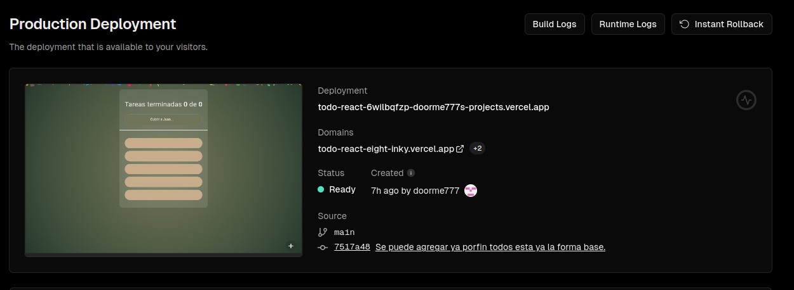

# Primer proyecto con **React.js**

Este es mi **primer proyecto** con esta tecnología. La verdad no, pero me gustaría decir que sí el más serio,
bueno para este proyecto hice un diseño en **Figma**, que no pero me ayuda porque mi meta es ser fullstack para
más enfocado en el diseño, y ser freelancer así que me ha ayudado en también implementar todo lo que sé de diseño:

### Figma

Link: https://www.figma.com/file/qLhY1NC88NwHjMDAIa4BZa/Untitled?type=design&node-id=8%3A246&mode=design&t=7lbg3TND8ATh7VAF-1

Me decide ir hacer el **deploy en vercel** por su facilidad, ademas ya le tenía ganas a
probar algo diferente a netlifly.

### Deploy

Link: todo-react-msmvrl89t-doorme777s-projects.vercel.app

En el proyecto me centré más en implementar lo que se decía en la clase y en entender lo que es **React.js**.
Los fundamentos ahora son los que más me importaba iterar lo más rápido.

Cualquier tipo de feedback que gusten darme estaré profundamente agradecido(Principalmente en la elección de colores).
